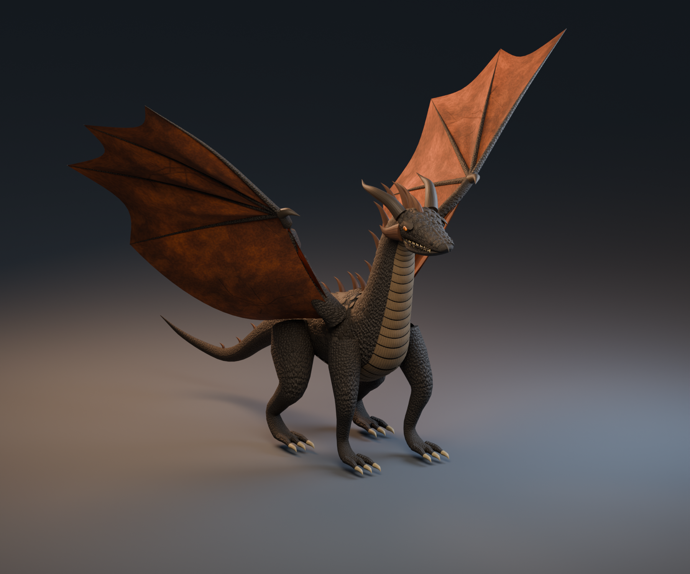

# Embercrest: the original-model experiment

The generated candidate selected and rigged afterward is documented in
[EMBERCREST_SELECTED.md](EMBERCREST_SELECTED.md), with its own GLB and Blender source.

An attempt (2026-09-08, made with GPT) to replace the two imported dragons with
an original rigged model built entirely by script. It works end to end, and it
is **not as good as either imported asset**, so the imported dragons remain the
hero models. The attempt is kept here because the pipeline is reusable and the
result is a useful measure of what procedural authoring can and cannot do.



## What was tried

Three original designs were generated as a concept sheet
([`artifacts/dragon-options/concepts.png`](../artifacts/dragon-options/concepts.png),
prompt in `prompt.txt` beside it) and panel A, Embercrest, was chosen: a
six-limbed dragon with charcoal-bronze scales, copper membranes, two swept
horns and a long tapering tail.

The model was then built in Blender by a Python script rather than sculpted:

| File | What it does |
|---|---|
| `tools/build_embercrest.py` | Geometry (Hermite-interpolated tubes for body, neck, tail and limbs; wing planes; horns and scutes), UVs, skin weights, a 68-bone skeleton, material wiring, glTF export, and `build_stats.json` |
| `tools/embercrest_materials.py` | NumPy-only procedural base, normal and ORM maps (cellular scutes, cracks, membrane veins, horn striations) |
| `tools/render_embercrest.py` | Cycles render of the real rig in a raised-wing pose, for the picture above |
| `tools/capture_embercrest.py` | In-engine acceptance captures via `--headless --model --studio --inspect` |
| `assets/embercrest.glb.flight.cfg` | The one handling override: `ground_offset` from the model's resting clearance |

Two revisions were made. The second raised the head into an upright neck,
slimmed the waist, enlarged the wing fan, curved the tail, added physical
scutes and face armour, and recalibrated the texture tile from 1.4 m to 4.0 m
so the scale detail read at model size.

The exported asset loads through the existing glTF path and joint mapper with
no Embercrest-specific code: 40.6k vertices, 64.9k triangles, 68 joints, 11
materials, bind error zero. The procedural rig drives it (wingbeat, tuck,
steering, tail and neck dynamics, jaw) and the animation suite has an
optional test that validates all of that whenever the GLB is present.

## Why it is not the hero model

Compared with the concept and with the imported models:

- **Silhouette is primitive.** Body, neck, tail and every limb are swept tubes,
  so the dragon reads as assembled from cylinders. The belly is a ribbed
  cylinder segment rather than plated scutes that follow the anatomy.
- **The head is a wedge.** Flat jaw line, a boxy skull, eyes and teeth as
  small stuck-on primitives. The concept's expressive predatory head is the
  thing that was lost most.
- **Wings are flat planes** with rigid finger tubes. They fold and flap
  correctly under the rig but have no camber, no membrane sag, and no
  scalloping between fingers.
- **Textures are uniform.** Procedural cellular noise is even everywhere, so
  there is no directional flow of scales, no size gradient from back to belly,
  and no painted wear. It reads as a pattern, not a hide.

None of this is a pipeline failure. It is what procedural tube geometry with
generated tiling textures produces, and the ceiling is a clean greybox-plus,
not a hero asset. A better original dragon needs a sculpted or generated mesh
(`MODEL_GENERATION.md` surveys the tools), with this script's rig and export
step kept as the back half.

## Rebuilding it

The GLB, the `.blend`, the textures and the v1 revision are not tracked
(`assets/embercrest/` and `assets/*.glb` are ignored). Regenerate with Blender
5.x from the repository root:

```sh
/Applications/Blender.app/Contents/MacOS/Blender --background \
  --python tools/build_embercrest.py -- --build
/Applications/Blender.app/Contents/MacOS/Blender --background \
  assets/embercrest/source/embercrest.blend --python tools/render_embercrest.py
python3 tools/capture_embercrest.py     # needs ./build/dragon
```

Then fly it:

```sh
./build/dragon --model assets/embercrest.glb
./build/dragon --model assets/embercrest.glb --studio 1 --inspect 150 16 18
```

Blender coordinates are +Y forward, +Z up; the export is glTF -Z forward, +Y
up, which is what the loader and the joint mapper expect.

## What it left in the engine

The only code change: the studio's grounded scenario now takes the model's
`ground_offset` from the flight tuning instead of a hard-coded hips height, so
a model with a different resting clearance sits on the ground rather than in
it. The default argument preserves the old value for callers without tuning.

## Captures

| Image | What it shows |
|---|---|
| [`concept-pose.png`](../artifacts/embercrest/concept-pose.png) | Cycles render, raised-wing pose |
| [`studio-0001.png`](../artifacts/embercrest/studio-0001.png) | Cycles render, three-quarter from above |
| [`flap.png`](../artifacts/embercrest/flap.png) | In-engine, studio flap scenario |
| [`ground.png`](../artifacts/embercrest/ground.png) | In-engine, grounded scenario with the derived `ground_offset` |
| [`build_stats.json`](../artifacts/embercrest/build_stats.json) | Mesh, bone and texture counts from the last build |
