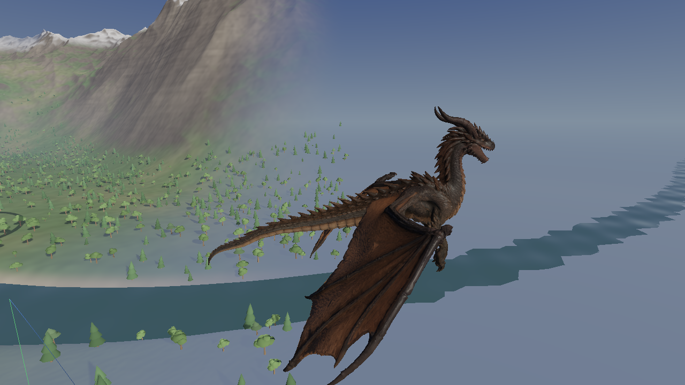
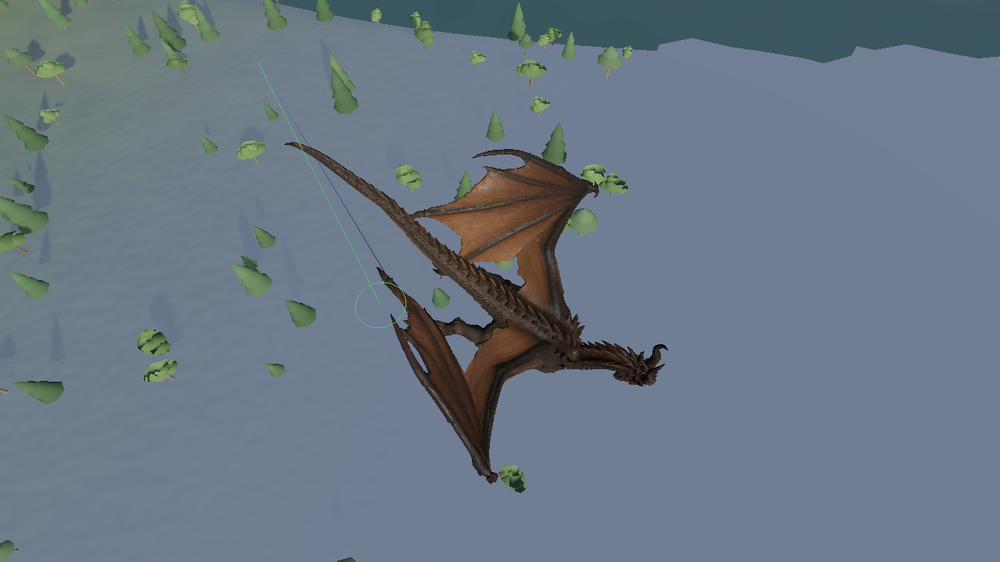
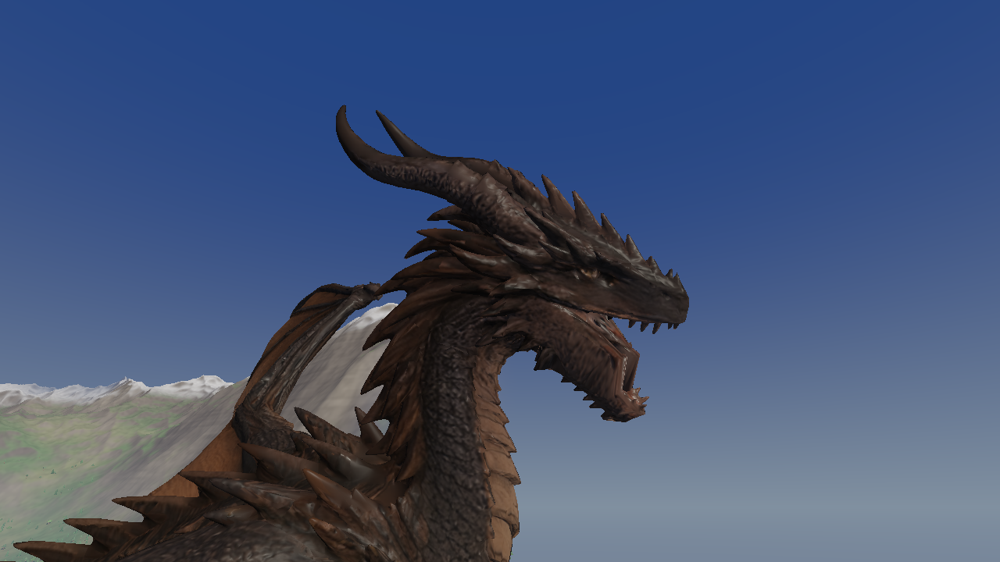

# Textured Embercrest — revision history

The Hunyuan textured candidate is simplified and rigged as
`assets/embercrest-textured.glb`, with editable source at
`assets/embercrest/textured/embercrest-textured.blend`. The generator and exact
export validation are described in [EMBERCREST_SELECTED.md](EMBERCREST_SELECTED.md).

Revision 1 contains 80,000 triangles, 61 deform bones, and the source's three
byte-identical 4096×4096 PBR maps. The export passes 508 animation checks with
zero bind error. These checks establish loader, joint-mapping and skinning
integrity; they do **not** establish animation quality.


## Revision 1 review

User review after the initial export found:

- The model feels stiff. Legs trail too far aft and intersect the torso,
  especially during braking.
- Wingbeats need more articulated folding at the elbow/wrist.
- Dive and pull-out folding produce an unattractive shape.
- The closed-mouth part of the attack motion glitches.

These observations supersede the initial visual acceptance wording. Numerical
skinning checks alone do not establish satisfactory motion. Revision 2 addresses
these scenarios; final motion quality still benefits from human playtesting.

## Revision 2

The asset now has **62 deform bones**. A `jaw_tip` landmark lets the engine test
which hinge direction lowers the mandible. Revision 1 had a leaf jaw, so this
test sampled the stationary pivot and attack motion incorrectly raised the jaw
into the skull. The added landmark corrects the opening direction without
changing the mesh weights or textures.

Model-specific animation settings live in
`assets/embercrest-textured.glb.rig.cfg`. The game loads this beside the GLB.
The profile reduces hind/foreleg trail to 14°/10° and leg fold to 42°. Braking
partially extends the limbs and offsets them forward. The wing now distributes
fold between elbow, wrist and fingers, adds 14° of raised-wing folding, and
limits the input flap angle to 42°. Dive sweep/fold are 42°/24°, with 12° droop;
these smaller cumulative rotations avoid the previous membrane collapse. This
is a moderate dive fold, not a fully closed wing against the flank. The jaw
opening is limited to 14° to reduce cheek stretching.

Wing articulation and leg posture can be tuned without re-exporting the asset;
models without this file keep the default settings. The Blender timeline is an
FK rig diagnostic, while the game supplies the final procedural flight motion.

In the game’s Dragon panel, **Rig profile** can save or reload the model’s
settings. This changes visual articulation; flight forces are unchanged.

### Reproducible pose review

The six reported problem views are retained in
`artifacts/embercrest-textured/revision1/` and `revision2/` with matching cameras
and times: `brake`, `flap-upstroke`, `tuck`, `pull-out`, `attack-rest`, and
`attack-mouth`. The full revision-2 suite also includes bind views, glide,
regular flap, ground, and a 7,200-frame turn soak.





```sh
cmake --build build --target dragon test_anim
EMBERCREST_TEST_MODEL=assets/embercrest-textured.glb ./build/test_anim
python3 tools/capture_embercrest.py --model assets/embercrest-textured.glb \
  --output artifacts/embercrest-textured/revision2
./build/dragon --model assets/embercrest-textured.glb
```

The rebuilt GLB remains 80,000 triangles with 73,550 exported vertices. All
three texture PNG hashes and material settings match the textured source.
The final model and its rig profile pass **526 animation checks, zero failures**,
including downward attack-jaw motion. The neutral asset passes 523 checks and
the default asset passes 522; all 10 CTest suites pass. All 14 native captures
completed, including the turn soak. These checks cover regressions and the
reviewed poses, not every possible collision between a membrane and the body.

Tangent and weight checks pass; the exact audit is retained in
`artifacts/embercrest-textured/revision2-audit.json`.

## Reversible checkpoint

The revision-1 GLB, Blender source, model handling configuration, generator and
validation reports are copied under
`assets/embercrest/textured/revisions/v1/`. A manifest records SHA-256 hashes.
The large asset files remain local under the existing ignore rules; the source,
documentation, configurations and selected evidence are committed to Git.

The Git checkpoint is `a571198`. To inspect the exact old motion, use the
archived executable as well as the archived model:

```sh
assets/embercrest/textured/revisions/v1/dragon \
  --model assets/embercrest/textured/revisions/v1/embercrest-textured.glb
```

To regenerate the current textured version:

```sh
/Applications/Blender.app/Contents/MacOS/Blender --background --factory-startup \
  --python tools/rig_embercrest_candidate.py -- --textured
```
