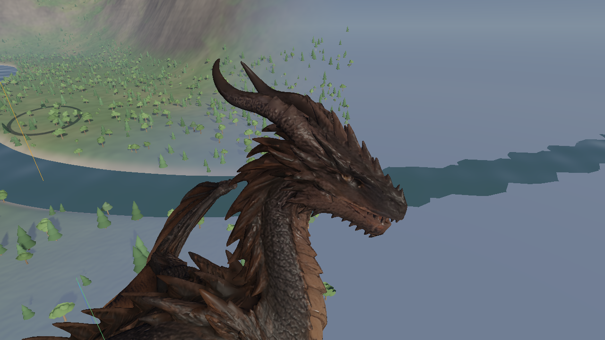
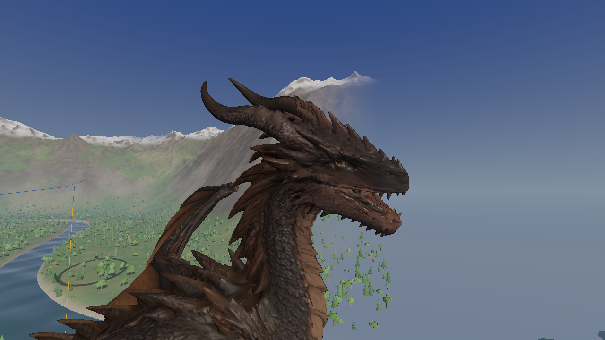
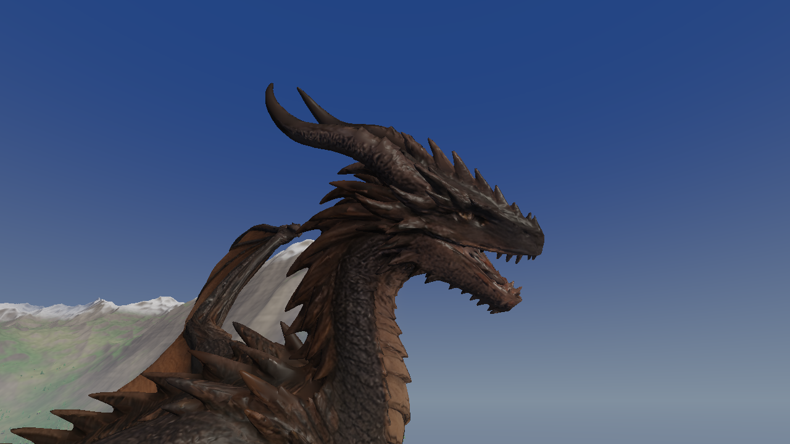
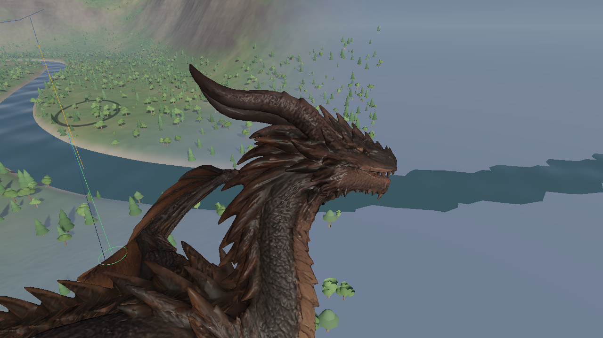
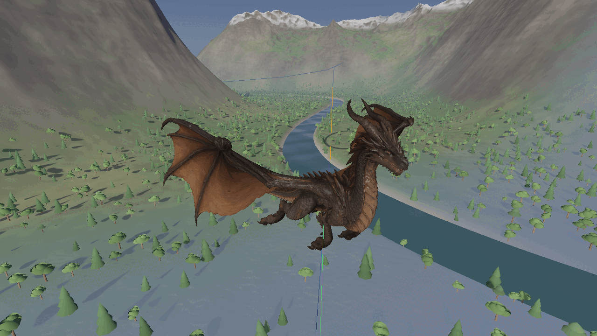
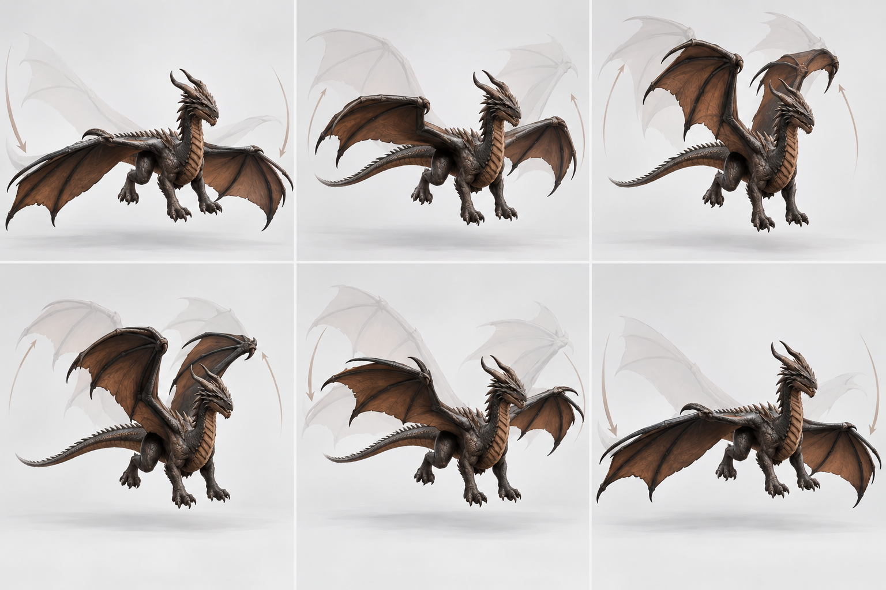

# Textured Embercrest — revision history

The Hunyuan textured candidate is simplified and rigged as
`assets/embercrest-textured.glb`, with editable source at
`assets/embercrest/textured/embercrest-textured.blend`. The generator and exact
export validation are described in [EMBERCREST_SELECTED.md](EMBERCREST_SELECTED.md).

Revision 1 contains 80,000 triangles, 61 deform bones, and the source's three
byte-identical 4096×4096 PBR maps. The export passes 508 animation checks with
zero bind error. These checks establish loader, joint-mapping and skinning
integrity; they do **not** establish animation quality.


## Revision 3 — wingbeat timing and closed mouth

Revision 2's static pose checks missed two important defects: its wing lag was
amplitude attenuation rather than time delay, and its jaw returned to an
already-open sculpt. This revision addresses both and replaces the previous
mouth acceptance image with explicit closed/open/closed evidence.

The jaw now has a **−16° rest offset** and a **16° attack excursion**. Full attack
returns to the authored gape; it no longer opens beyond that shape. Chatter is
bounded within this range. The mandible mask follows the mouth gap and blends
near the hinge; the old low plane incorrectly pinned part of the lower gum and
teeth to the skull, creating angular strips during closure. Neck weights, UVs,
and PBR maps are preserved.






The wingbeat uses delayed cyclic sampling for outer joints and timed recovery
folding, with extension before the next downstroke. The intent is overlapping
elbow, wrist, and finger movement instead of every joint reversing together.
These controls are model-specific; the legacy behavior remains the default.
The profile delays each outer station by 0.035 cycles, reduces legacy amplitude
attenuation to 0.08, adds 18° of recovery fold, and starts reopening at phase
0.68. Recovery strength fades with flapping amplitude and wing tuck; the visual
flap limit is applied after the delayed sample.



This loop contains nine native frames sampled evenly through the 0.9-second
studio cycle. It shows the motion under review; the concept below is not a
render of the implementation.

```sh
./build/dragon --model assets/embercrest-textured.glb
python3 tools/capture_embercrest.py --model assets/embercrest-textured.glb \
  --output artifacts/embercrest-textured/revision3
```

The textured model and profile pass 546 animation checks, including actual
ordering of joint reversal times, bounded jaw opening and return to the closed
offset. Texture PNGs and materials still match the source exactly. The current
binary audit is `artifacts/embercrest-textured/revision3/audit.json`. All 10
CTest suites pass; 25 native pose/phase captures completed, including the
7,200-frame turn soak. These are regression and visual inspection results;
human assessment of the final motion remains the acceptance gate.

A six-panel concept reference was generated with the built-in imagegen tool,
using the existing model render as its visual reference. It guides silhouette
and timing rather than serving as anatomical or physical evidence. The full
prompt is in `artifacts/embercrest-textured/revision3/concept-prompt.txt`.



## Revision 1 review

User review after the initial export found:

- The model feels stiff. Legs trail too far aft and intersect the torso,
  especially during braking.
- Wingbeats need more articulated folding at the elbow/wrist.
- Dive and pull-out folding produce an unattractive shape.
- The closed-mouth part of the attack motion glitches.

These observations supersede the initial visual acceptance wording. Numerical
skinning checks alone do not establish satisfactory motion. Revision 2 addresses
these scenarios; final motion quality still benefits from human playtesting.

## Revision 2 (superseded motion review)

The asset now has **62 deform bones**. A `jaw_tip` landmark lets the engine test
which hinge direction lowers the mandible. Revision 1 had a leaf jaw, so this
test sampled the stationary pivot and attack motion incorrectly raised the jaw
into the skull. The added landmark corrects the opening direction without
changing the mesh weights or textures.

Model-specific animation settings live in
`assets/embercrest-textured.glb.rig.cfg`. The game loads this beside the GLB.
The profile reduces hind/foreleg trail to 14°/10° and leg fold to 42°. Braking
partially extends the limbs and offsets them forward. The wing now distributes
fold between elbow, wrist and fingers, adds 14° of raised-wing folding, and
limits the input flap angle to 42°. Dive sweep/fold are 42°/24°, with 12° droop;
these smaller cumulative rotations avoid the previous membrane collapse. This
is a moderate dive fold, not a fully closed wing against the flank. The jaw
opening is limited to 14° to reduce cheek stretching.

Wing articulation and leg posture can be tuned without re-exporting the asset;
models without this file keep the default settings. The Blender timeline is an
FK rig diagnostic, while the game supplies the final procedural flight motion.

In the game’s Dragon panel, **Rig profile** can save or reload the model’s
settings. This changes visual articulation; flight forces are unchanged.

### Reproducible pose review

The six reported problem views are retained in
`artifacts/embercrest-textured/revision1/` and `revision2/` with matching cameras
and times: `brake`, `flap-upstroke`, `tuck`, `pull-out`, `attack-rest`, and
`attack-mouth`. The full revision-2 suite also includes bind views, glide,
regular flap, ground, and a 7,200-frame turn soak.

The revision-2 mouth screenshot exposed over-opening and cheek distortion; it
is retained only as historical evidence, not as an accepted result. The mouth
also stayed open at rest because the sculpt itself was authored with a gape.
User review further identified mechanical wingbeat timing.

```sh
cmake --build build --target dragon test_anim
EMBERCREST_TEST_MODEL=assets/embercrest-textured.glb ./build/test_anim
python3 tools/capture_embercrest.py --model assets/embercrest-textured.glb \
  --output artifacts/embercrest-textured/revision2
./build/dragon --model assets/embercrest-textured.glb
```

The rebuilt GLB remains 80,000 triangles with 73,550 exported vertices. All
three texture PNG hashes and material settings match the textured source.
The revision-2 model and its rig profile passed **526 animation checks, zero failures**,
including downward attack-jaw motion. The neutral asset passes 523 checks and
the default asset passes 522; all 10 CTest suites pass. All 14 native captures
completed, including the turn soak. These checks cover regressions and the
reviewed poses, not every possible collision between a membrane and the body.

Tangent and weight checks pass; the exact audit is retained in
`artifacts/embercrest-textured/revision2-audit.json`.

## Reversible checkpoint

The revision-1 GLB, Blender source, model handling configuration, generator and
validation reports are copied under
`assets/embercrest/textured/revisions/v1/`. A manifest records SHA-256 hashes.
The large asset files remain local under the existing ignore rules; the source,
documentation, configurations and selected evidence are committed to Git.

The initial Git checkpoint is `a571198`; revision 2 is `e21d0ac`. Its GLB,
Blender source and rig profile are also saved under
`assets/embercrest/textured/revisions/v2/`. To inspect the exact old motion, use the
archived executable as well as the archived model:

```sh
assets/embercrest/textured/revisions/v1/dragon \
  --model assets/embercrest/textured/revisions/v1/embercrest-textured.glb
```

To regenerate the current textured version:

```sh
/Applications/Blender.app/Contents/MacOS/Blender --background --factory-startup \
  --python tools/rig_embercrest_candidate.py -- --textured
```
