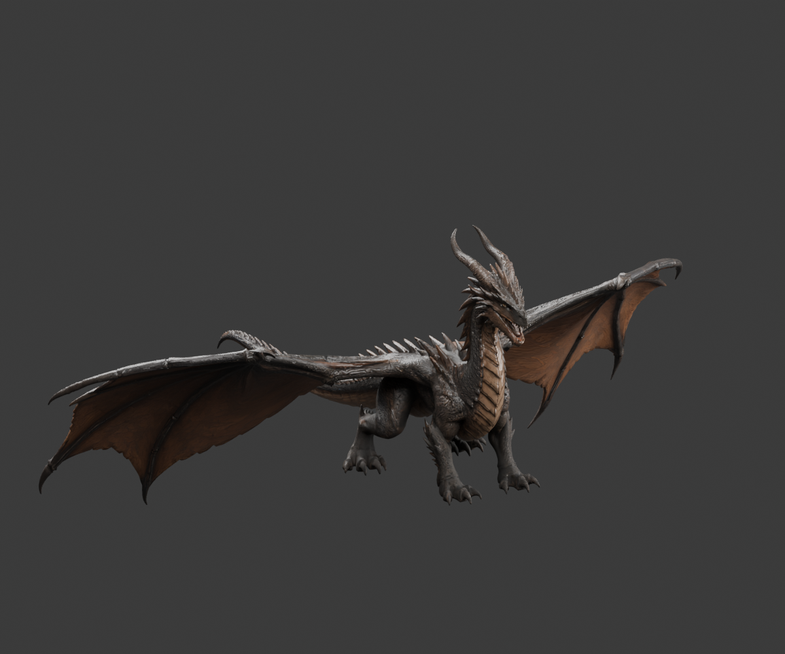

# Textured Embercrest — rig revision 1

The Hunyuan textured candidate is simplified and rigged as
`assets/embercrest-textured.glb`, with editable source at
`assets/embercrest/textured/embercrest-textured.blend`. The generator and exact
export validation are described in [EMBERCREST_SELECTED.md](EMBERCREST_SELECTED.md).

Revision 1 contains 80,000 triangles, 61 deform bones, and the source's three
byte-identical 4096×4096 PBR maps. The export passes 508 animation checks with
zero bind error. These checks establish loader, joint-mapping and skinning
integrity; they do **not** establish animation quality.



## Human review and remaining issues

User review after the initial export found:

- The model feels stiff. Legs trail too far aft and intersect the torso,
  especially during braking.
- Wingbeats need more articulated folding at the elbow/wrist.
- Dive and pull-out folding produce an unattractive shape.
- The closed-mouth part of the attack motion glitches.

These observations supersede the initial visual acceptance wording. Full
animation-quality acceptance remains open until these exact scenarios have
been corrected and reviewed. Texture preservation and numerical skinning checks
remain valid independently.

## Reversible checkpoint

The revision-1 GLB, Blender source, model handling configuration, generator and
validation reports are copied under
`assets/embercrest/textured/revisions/v1/`. A manifest records SHA-256 hashes.
The large asset files remain local under the existing ignore rules; the source,
documentation, configurations and selected evidence are committed to Git.

To inspect this version in the game:

```sh
./build/dragon --model assets/embercrest/textured/revisions/v1/embercrest-textured.glb
```

To regenerate the current textured version:

```sh
/Applications/Blender.app/Contents/MacOS/Blender --background --factory-startup \
  --python tools/rig_embercrest_candidate.py -- --textured
```
